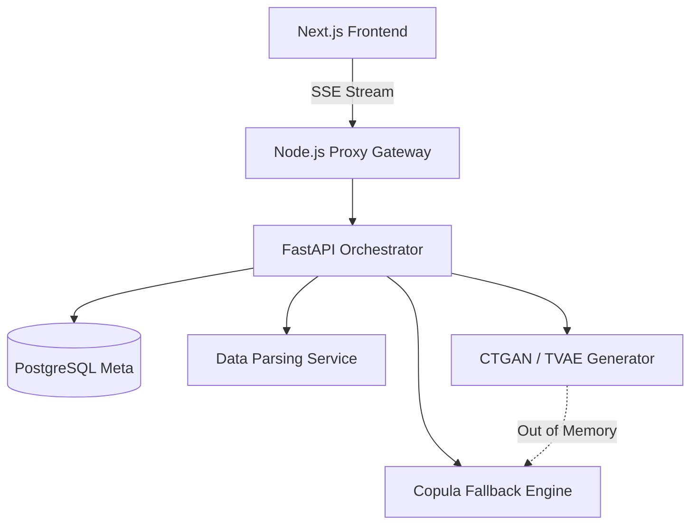

  <h1>🦊 Vulpix: Enterprise AI Data Copilot</h1>
  
<b>Agentic data workflows, zero-memory-breach orchestration, and constraint-aware synthesis.</b>

  
  

## System Architecture
Vulpix operates on a strictly separated Microservices architecture orchestrated via Docker Compose, utilizing 17 distinct Python/FastAPI microservices, a Node.js/Next.js frontend, a Node.js backend proxy, PostgreSQL, and a Google Cloud Storage (GCS) emulator for stateless data transfer.

## Features
- **Algorithmic Fallback Mechanisms:** If deep learning models hit OOM, the system autonomously degrades to Copula or Bootstrap modeling to guarantee delivery.
- **Agentic Workflow:** Intelligent LangGraph planner routing data between Imputer, Balancer, and Outlier Detector.
